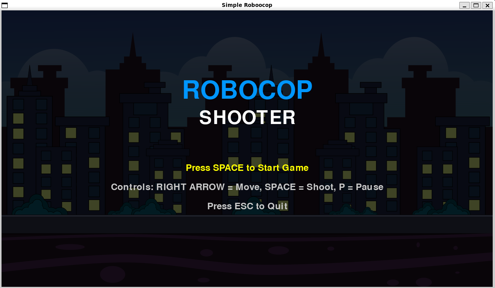
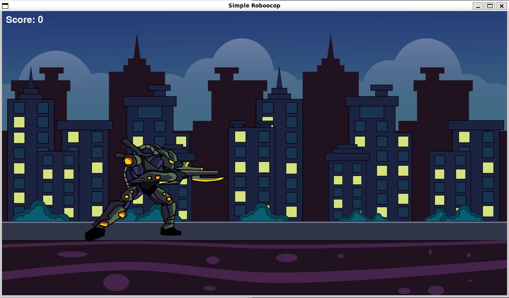
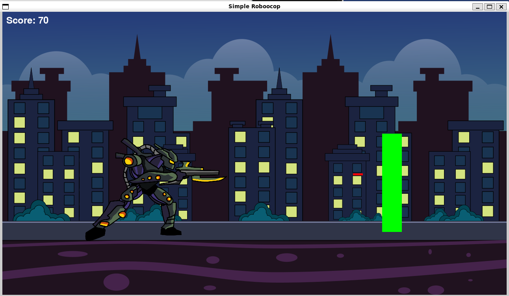
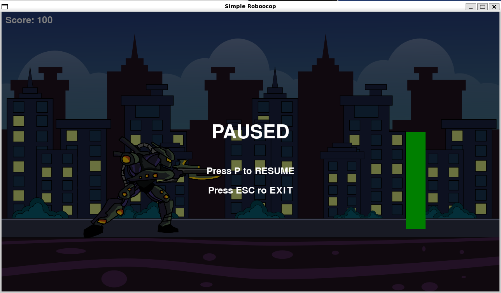

# Simple RoboCop Shooter Game

A retro-style side-scrolling shooter game inspired by RoboCop. Built using **Python** and **Pygame** as part of the [#BuildGamesChallenge](https://builder.aws.com/content/2y6egGcPAGQs8EwtQUM9KAONojz/build-games-challenge-build-classics-with-amazon-q-developer-cli) with the help of Amazon Q Developer CLI.



---

## Game Features

- Scrollable background for side-scrolling effect  
- Character movement (right arrow key)  
- Fire red bullet projectiles using spacebar  
- Basic game loop at 60 FPS  
- Retro arcade-inspired look

---

## Getting Started

### Prerequisites

You need Python 3 and `pip` installed.  
Install Pygame by running:

```bash
pip install pygame
```

### Run the Game

Make sure you're in the project folder and run:

```bash
python3 main.py
```

---

## How Amazon Q Helped

This project was built using Amazon Q Developer CLI and guided by natural language prompts.  
I used Q to:

- Set up the Pygame window and frame logic  
- Learn how to handle input and movement  
- Implement bullet shooting mechanics  
- Understand concepts like `pygame.Rect`, `screen.blit()`, and game loops  
- Debug and polish gameplay logic

Although Amazon Q generated some starter code, the majority of logic and structure was written and understood manually by me, for learning purposes.

---

## Screenshots





---

## Related Links

- [GitHub Repository](https://github.com/GLJ20/simple-robocop)
- Blog Post / Devlog: *Coming soon*

---

## License

This project is licensed under the [MIT License](LICENSE).

---

## Challenge Info

Built for the Amazon Q Build Games Challenge 2025  
Hashtags used: `#BuildGamesChallenge` `#AmazonQDevCLI`
